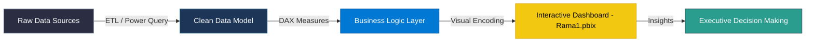

<div align="center">

  # 📊 POWER BI ENTERPRISE ANALYTICS DASHBOARD
  ### *Transforming Complex Data into Strategic Business Intelligence*

  <p align="center">
    <a href="https://powerbi.microsoft.com/"></a>
    <a href="https://microsoft.com/"></a>
    <a href="https://dax.guide/"></a>
    <a href="https://github.com/Ramaalodat/powerbi/stargazers"></a>
    <a href="https://github.com/Ramaalodat/powerbi/network/members"></a>
  </p>

  <p align="center">
    <b>An end-to-end interactive Business Intelligence reporting solution built with Microsoft Power BI Desktop.</b>
    <br />
    <a href="#-quick-start">Quick Start</a>
    •
    <a href="#-dashboard-highlights">Key Features</a>
    •
    <a href="#-data-architecture">Architecture</a>
    •
    <a href="#-author">Author</a>
  </p>

  ---
</div>

> [!IMPORTANT]
> **Production Ready Report File:** Access the primary Power BI report file [`Rama1.pbix`](file:///e:/ramaProject/power%20bi/Rama1.pbix) directly to explore interactive visual analytics, drill-through capabilities, and DAX calculations.

---

## 🌟 Executive Summary

The **Power BI Enterprise Analytics Dashboard** provides real-time decision-making support by converting raw datasets into interactive visual stories. Designed with executive UX standards, this report incorporates dynamic DAX metrics, data modeling best practices, and responsive visual filtering to monitor critical business KPIs.



---

## 🔥 Key Capabilities & Visual Modules

| Module | Core Functionality | Impact & Benefit |
| :--- | :--- | :--- |
| 📊 **Dynamic KPI Tracker** | Summary cards tracking period-over-period performance | Immediate visibility into core performance metrics |
| 🔀 **Interactive Slicers** | Multi-attribute filtering (Date, Category, Region) | Custom granularity analysis on-the-fly |
| 🧮 **Advanced DAX Metrics** | Calculated measures, YTD/MTD time-intelligence | Precise financial and operational metrics calculation |
| 🎨 **Executive UI/UX** | Dark/Light cohesive color palette & visual layout | Reduced cognitive load and seamless story navigation |
| 🔍 **Drill-Through Insights** | Deep-dive analytical views from high-level summaries | Root-cause identification for data anomalies |

---

## 🛠️ Technology Stack & Tools

<table align="center">
  <tr>
    <td align="center" width="20%">
      <br/>
      <b>Power BI Desktop</b><br/>
      <sub>Data Modeling & UX</sub>
    </td>
    <td align="center" width="20%">
      <br/>
      <b>Power Query M</b><br/>
      <sub>Data Extraction & Transformation</sub>
    </td>
    <td align="center" width="20%">
      <br/>
      <b>DAX Engine</b><br/>
      <sub>Analytical Calculations</sub>
    </td>
    <td align="center" width="20%">
      <br/>
      <b>Git & GitHub</b><br/>
      <sub>Version Management</sub>
    </td>
  </tr>
</table>

---

## 📂 Repository Structure

```gcode
📦 powerbi
 ┣ 📜 Rama1.pbix          # Primary Power BI Desktop Report File
 ┣ 📜 .gitignore          # Git exclusion rules for temporary BI cache
 ┗ 📜 README.md           # Professional project documentation
```

---

## 🚀 Quick Start Guide

> [!TIP]
> Ensure you have **Microsoft Power BI Desktop** (Latest Version) installed on Windows for optimal compatibility.

### 1️⃣ Prerequisites
Download and install [Power BI Desktop](https://powerbi.microsoft.com/desktop/) from the official Microsoft Store or website.

### 2️⃣ Clone Repository
```bash
git clone https://github.com/Ramaalodat/powerbi.git
cd powerbi
```

### 3️⃣ Launch Report
Double-click [`Rama1.pbix`](file:///e:/ramaProject/power%20bi/Rama1.pbix) or open via Power BI Desktop:
`File` ➔ `Open Report` ➔ `Browse Reports` ➔ Select `Rama1.pbix`

---

## 👨‍💻 Author

<div align="center">

  ### **Rama Al-Odat**
  *Data Analyst & Power BI Developer*

  [](https://github.com/Ramaalodat)
  [](https://github.com/Ramaalodat/powerbi)

</div>

---

<div align="center">
  <sub>Built with precision and passion by Rama Al-Odat • Licensed under MIT</sub>
</div>
